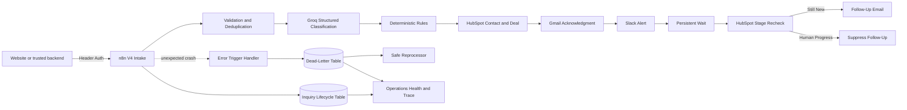

# Production AI Construction Inquiry Automation

An n8n portfolio project that turns inbound construction inquiries into validated, AI-enriched, traceable CRM opportunities with customer acknowledgment, internal alerts, controlled follow-up, centralized error handling, and safe recovery.

> Demo video: add the final Loom URL here.

## Business problem

Construction companies receive inquiries through forms, email, referrals, and phone notes. Staff manually validate details, identify urgent work, create CRM records, notify the right person, acknowledge the customer, and remember follow-ups. This creates several risks:

- urgent damage is missed;
- duplicate submissions create duplicate CRM records;
- incomplete requests are handled inconsistently;
- provider failures silently lose leads;
- reminders continue after a salesperson has acted;
- nobody can quickly trace what happened to one inquiry.

## Solution

```text
Authenticated Webhook
→ Normalize and Validate
→ Generate Identity and Deduplicate
→ Store Intake
→ Structured AI Classification
→ Deterministic Business Rules
→ HubSpot Contact and Deal Synchronization
→ Gmail Acknowledgment
→ Priority-Based Slack Alert
→ Durable Wait
→ HubSpot Stage Recheck
→ Send or Suppress Follow-Up
→ Persist Lifecycle and Operational Status
```

Unexpected crashes invoke a separate Error Trigger workflow. Failed attempts become linked dead letters and can be reviewed through a manual, dry-run-first, stage-bounded reprocessor.

## Architecture



## What I built

- Canonical JSON normalization and validation
- Stable inquiry, deduplication, execution, and correlation identifiers
- Schema-constrained Groq classification with independent validation
- Deterministic priority, ownership, next-action, and CRM rules
- HubSpot Contact search/create/update and associated Deal creation
- Search-before-write protection against duplicate Deals
- Gmail acknowledgment templates and priority-based Slack alerts
- Persistent Wait scheduling with HubSpot stage-based reminder suppression
- Provider retries with normalized partial-failure states
- Central Error Trigger workflow for unexpected crashes
- Dead-letter storage and main-record linking
- Human-controlled, bounded reprocessing that retries only the failed operation
- Operations dashboard, correlation trace, health thresholds, and alert fingerprinting
- Header-authenticated V4 webhook

## Reliability behavior

| Condition | Behavior |
|---|---|
| Missing/incorrect webhook key | Reject before workflow execution |
| Invalid core payload | HTTP 400; no storage or external action |
| Missing contact method | Store for manual review and notify operations |
| Duplicate source event | HTTP 200 duplicate; no repeated side effect |
| Low-confidence/malformed AI | Manual review; no CRM automation |
| Spam/not-a-fit | Store classification; skip CRM and communication |
| HubSpot Contact ambiguity | Stop for manual review instead of guessing |
| Existing Deal | Reuse it instead of creating a duplicate |
| Provider outage | Retry three times, then persist normalized failure |
| Unexpected workflow crash | Error Handler creates and links a dead letter |
| Failed communication recovery | Retry only the failed provider |
| Deal progressed during Wait | Suppress automated follow-up |

## Verified evidence

- Authentication rejection and success paths
- Blocking validation, manual review, spam, urgent, and duplicate routes
- HubSpot Contact–Deal association through API read-back
- Gmail and Slack delivery IDs persisted
- Wait resume, follow-up send, and follow-up suppression
- Controlled Gmail and Slack failures
- Centralized unexpected-error handling
- Unsafe retry refusal and successful Slack-only recovery
- Operations dashboard and correlation trace

See [`docs/test-results.md`](docs/test-results.md).

## Technology

- n8n 2.33.0 in Docker Compose
- Groq structured output using `openai/gpt-oss-20b`
- HubSpot CRM API
- Gmail OAuth2
- Slack API
- n8n Data Tables
- JSON Schema and deterministic JavaScript rules

## Repository structure

```text
workflows/     Sanitized n8n workflow templates
schemas/       Input, AI-output, and Data Table schemas
samples/       Synthetic request fixtures
docs/          Architecture, setup, handoff, tests, and demo material
```

## Running the project

The workflows are inactive templates. Import them, create your own credentials and Data Tables, replace all `CONFIGURE_*` placeholders, link the Error Handler in the main workflow settings, and publish only after completing the setup checklist.

See [`docs/setup-and-handoff.md`](docs/setup-and-handoff.md).

## Security

- No API keys or live credential IDs are included.
- The intake webhook uses Header Auth.
- Public deployment requires HTTPS and upstream rate limiting.
- A browser form should call a trusted backend that adds the webhook secret server-side.
- HubSpot, Gmail, and Slack should use least-privilege scopes.
- Customer-payload retention must be defined per deployment.

## Scope

The demo runs locally with synthetic inquiry data and a controlled email-recipient override. The repository does not include a hosted endpoint, credentials, or a universal retry policy. Recovery rules must reflect each client's systems and side effects.

## Engineering outcome

```text
input
→ business logic
→ automation
→ integrations
→ output
→ error handling
→ observability
→ safe recovery
```
